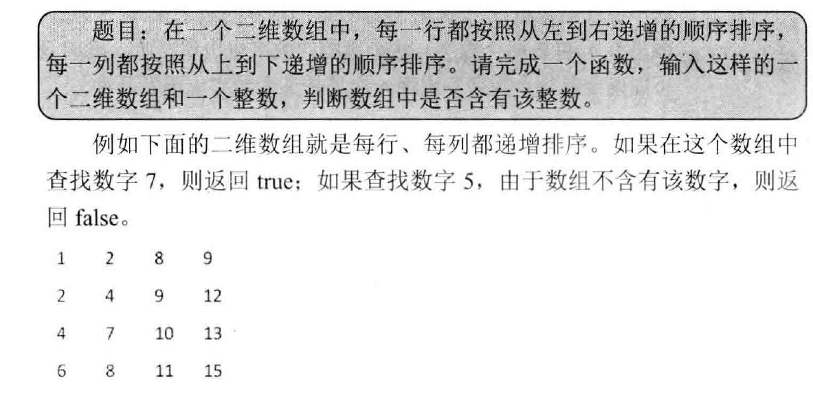

## 二维数组中的查找

> 

首先选取数组右上角的数字。如果该数字等于要查找的数字，则查找过程结束；如果该数字大于要查找的数字，则剔除这个数字所在的列；如果该数字小于要查找的数字，则剔除这个数字所在的行。这样每一步都可以缩小范围，直到找到要查找的数字，或者查找的范围为空。

```c++
#include<iostream>

using namespace std;

// 传入二维数组
bool find1(int matrix[][4], int rows, int columns, int number) {
	bool result = false;

	if(matrix != nullptr) {
		int row = 0;
		int column = columns - 1;
		while(row < rows && column >= 0) {
			if(matrix[row][column] == number) {
				result = true;
				break;
			} else {
				if(matrix[row][column] > number) {
					column --;
				} else {
					row ++;
				}
			}
		}
	}

	return result;
}

// 传入一维数组
bool find2(int* matrix, int rows , int columns, int number) {
	bool result = false;

	if(matrix != nullptr) {
		int row = 0;
		int column = columns - 1;
		while(row < rows && column >= 0) {
			if(matrix[row * column + column] == number) {
				result = true;
				break;
			} else {
				if(matrix[row * column + column] > number) {
					column --;
				} else {
					row ++;
				}
			}
		}
	}
	return result;
}

int main(int argc, char *argv[])
{
	int a[4][4] = {{1, 2, 8, 9},{2, 4, 9, 12}, {4, 7, 10, 13}, {6, 8, 11, 15}};
	// test1
	bool result1 = find1(a, 4, 4, 7);
	cout << "test1 find 7 : " << result1 << endl;
	bool result2 = find1(a, 4, 4, 5);
	cout << "test1 find 5 : " << result2 << endl;
	// test2
	bool result3 = find1(a, 4, 4, 7);
	cout << "test2 find 7 : " << result3 << endl;
	bool result4 = find1(a, 4, 4, 5);
	cout << "test2 find 5 : " << result4 << endl;


	return 0;
}
```