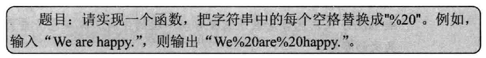
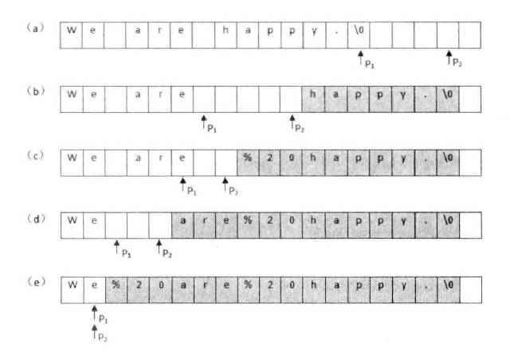

## 替换空格

> 

两个指针，一个指向原始字符串末尾，另一个指向替换后的字符传末尾，然后从后往前逐一替换。



```c++
#include<iostream>

using namespace std;

void replaceSpaces(char* str, int length) {
	if(str == nullptr || length <= 0) {
		return;
	}

	// 真实长度
	int realLength = 0;
	// 空格长度
	int blankLength = 0;

	// 统计字符
	int i = 0;
	while(str[i] != '\0') {
		realLength ++;
		if(str[i] == ' ') {
			blankLength ++;
		}

		i ++;
	}

	int newLength = realLength + (2 + blankLength);
	if(newLength > length) {
		return;
	}

	int indexOfRealLength = realLength;
	int indexOfNewLength = newLength;

	while(indexOfRealLength >= 0 && indexOfNewLength > indexOfRealLength) {
		if(str[indexOfRealLength] == ' ') {
			str[indexOfNewLength --] = '0';
			str[indexOfNewLength --] = '2';
			str[indexOfNewLength --] = '%';
		} else {
			str[indexOfNewLength --] = str[indexOfRealLength];
		}
		indexOfRealLength --;
	}
}

int main(int argc, char *argv[])
{
	const int length = 100;
	char a[length] = "We are happy.";
	char b[length] = "   ";
	replaceSpaces(a, length);
	replaceSpaces(b, length);
	cout << a << endl;
	cout << b << endl;
	return 0;
}
```