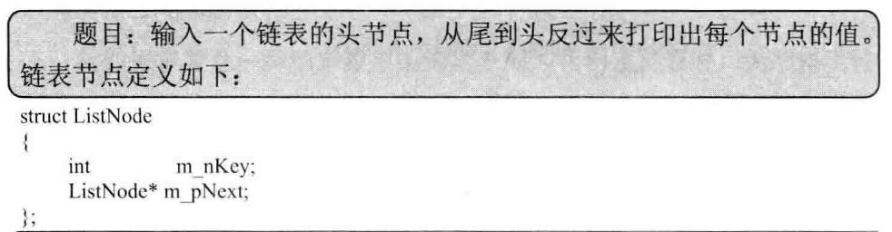

## 从头到尾打印链表

> 

1. 栈实现
2. 递归实现

```c++
#include<iostream>
#include<stack>

using namespace std;

struct ListNode {
	int m_nKey;
	ListNode* m_pNext;
};

ListNode* createListNode(int value) {
	ListNode* pNode = new ListNode();
	pNode->m_nKey = value;
	pNode->m_pNext = nullptr;
	return pNode;
}

ListNode* connectListNode(ListNode* node1, ListNode* node2) {
	if(node1 == nullptr) {
		cout << "connectListNode error" << endl;
		exit(1);
	}
	node1->m_pNext = node2;
	return node1;
}

void destroyList(ListNode* pHead) {
	ListNode* pNode = pHead;
	if(pNode != nullptr) {
		pHead = pHead->m_pNext;
		delete pNode;
		pNode = pHead;
	}
}

void printListReversingly_Iteratively(ListNode* pHead) {
	stack<ListNode*> nodes;
	ListNode* pNode = pHead;
	while(pNode != nullptr) {
		nodes.push(pNode);
		pNode = pNode->m_pNext;
	}

	while(!nodes.empty()) {
		pNode = nodes.top();
		cout << pNode->m_nKey << endl;
		nodes.pop();
	}
}

void printListReversingly_Recursively(ListNode* pHead) {
	if(pHead != nullptr) {
		if(pHead->m_pNext != nullptr) {
			printListReversingly_Recursively(pHead->m_pNext);
		}
		cout << pHead->m_nKey << endl;
	}
}

int main(int argc, char *argv[])
{
	ListNode* node1 = createListNode(1);	
	ListNode* node2 = createListNode(2);	
	ListNode* node3 = createListNode(3);	
	ListNode* node4 = createListNode(4);	
	ListNode* node5 = createListNode(5);	
	ListNode* node6 = createListNode(6);

	connectListNode(node1, node2);
	connectListNode(node2, node3);
	connectListNode(node3, node4);
	connectListNode(node4, node5);
	connectListNode(node5, node6);

	cout << "------------test Iteratively------------" << endl;
	printListReversingly_Iteratively(node1);

	cout << "------------test Recursively------------" << endl;
	printListReversingly_Recursively(node1);

	destroyList(node1);
	return 0;
}
```