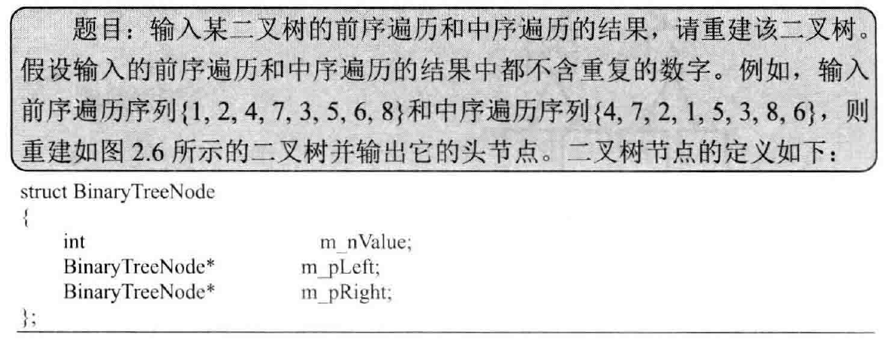

## 重建二叉树

> 

```c++
#include<iostream>
#include<exception>

using namespace std;

struct BinaryTreeNode {
	int m_nValue;
	BinaryTreeNode* m_pLeft;
	BinaryTreeNode* m_pRight;
};

void PrintTreeNode(const BinaryTreeNode* pNode) {
	if(pNode != nullptr) {
		printf("value of this node is: %d\n", pNode->m_nValue);

		if(pNode->m_pLeft != nullptr)
			printf("value of its left child is: %d.\n", pNode->m_pLeft->m_nValue);
		else
			printf("left child is nullptr.\n");

		if(pNode->m_pRight != nullptr)
			printf("value of its right child is: %d.\n", pNode->m_pRight->m_nValue);
		else
			printf("right child is nullptr.\n");
	}
	else {
		printf("this node is nullptr.\n");
	}

	printf("\n");
}

void PrintTree(const BinaryTreeNode* pRoot) {
	PrintTreeNode(pRoot);

	if(pRoot != nullptr) {
		if(pRoot->m_pLeft != nullptr)
			PrintTree(pRoot->m_中国rder) {
		if(startInorder == endInorder && *startPreorder == *startInorder) {
			return root;
		} else {
			//throw exception("Invalid input.");
			throw logic_error("Invalid input");
		}
	}

	// 在中序遍历中找到根节点的值
	int* rootInorder = startInorder;
	while(rootInorder <= endInorder && *rootInorder != rootValue) {
		rootInorder ++;
	}
	if(rootInorder == endInorder && *rootInorder != rootValue) {
		throw logic_error("Invalid input");
	}

	int leftLength = rootInorder - startInorder;
	int* leftPreorderEnd = startPreorder + leftLength;

	if(leftLength > 0) {
		// 构建左子树
		root->m_pLeft = ConstructCore(startPreorder + 1, leftPreorderEnd, startInorder, rootInorder - 1);
	}

	if(leftLength < endPreorder - startPreorder) {
		// 构建右子树
		root->m_pRight = ConstructCore(leftPreorderEnd + 1, endPreorder, rootInorder + 1, endInorder);
	}

	return root;
}

BinaryTreeNode* Construct(int* preorder, int* inorder, int length) {
	if(preorder == nullptr || inorder == nullptr || length <= 0) {
		return nullptr;
	}

	return ConstructCore(preorder, preorder + length - 1, inorder, inorder + length - 1);

}

int main(int argc, char *argv[])
{
	const int length = 8;
	int preorder[length] = {1, 2, 4, 7, 3, 5, 6, 8};
	int inorder[length] = {4, 7, 2, 1, 5, 3, 8, 6};
	
	cout << "The preorder squence is : " ;
	for(int i = 0; i < length; i ++) {
		cout << preorder[i];
	}
	cout << endl;

	cout << "The inorder squence is : " ;
	for(int i = 0; i < length; i ++) {
		cout << inorder[i];
	}
	cout << endl;

	try {
		BinaryTreeNode* root = Construct(preorder, inorder, length);
		PrintTree(root);
		DestroyTree(root);
	} catch(logic_error& exception) {
		cout << "Invalid input" << endl;
	}


	return 0;
}
```