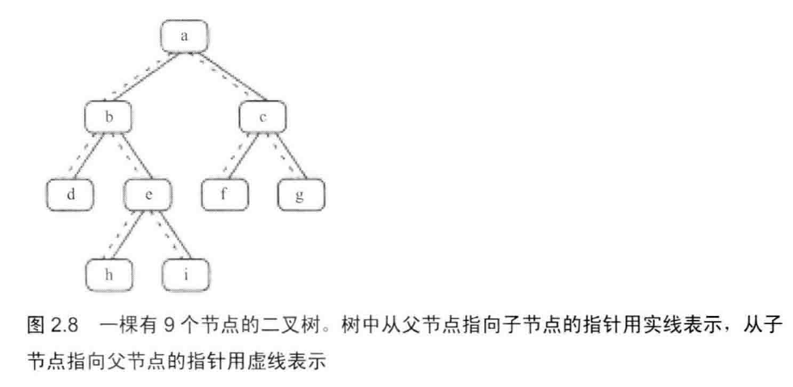

## 二叉树的下一个节点

> 

> 如下所示 中序遍历为{d, b, h, e, i, a, f, c, g}

> 

- 如果一个节点有右子树，那么它的下一个节点就是它的右子树中的最左子节点。也就是说，从右子节点出发一直沿着指向左子节点的指针，就能找到下一节点。

- 如果一个节点没有右子树，如果该节点是它父节点的左节点，那么它的下一个节点就是它的父节点。

- 如果一个节点既没有右子树，并且它还是它父节点的右子节点，可以沿着指向父节点的指针一直向上遍历，直到找到一个是它父节点的左子节点的节点。如果存在这样的节点，那么这个节点的父节点就是要找的下一节点。


```c++
#include <iostream>

using namespace std;

struct BinaryTreeNode {
	int m_nValue;
	BinaryTreeNode* m_pLeft;
	BinaryTreeNode* m_pRight;
	BinaryTreeNode* m_pParent;
};

BinaryTreeNode* getNext(BinaryTreeNode* pNode) {
	if(pNode == nullptr) {
		return nullptr;
	}
	BinaryTreeNode* pNext = nullptr;
	if(pNode->m_pRight != nullptr) {
		BinaryTreeNode* pRight = pNode->m_pRight;
		while(pRight->m_pLeft != nullptr)
			pRight = pRight->m_pLeft;
		pNext = pRight;
	} else if(pNode->m_pParent != nullptr) {
		BinaryTreeNode* pCurrent = pNode;
		BinaryTreeNode* pParent = pNode->m_pParent;
		while(pParent != nullptr && pCurrent == pParent->m_pRight) {
			pCurrent = pParent;
			pParent = pParent->m_pParent;
		}

		pNext = pParent;
	}

	return pNext;
}

// 构建二叉树

BinaryTreeNode* createBinaryTreeNode(int value) {
	BinaryTreeNode* pNode = new BinaryTreeNode();
	pNode->m_nValue = value;
	pNode->m_pLeft = nullptr;
	pNode->m_pRight = nullptr;
	pNode->m_pParent = nullptr;

	return pNode;
}

void connectTreeNodes(BinaryTreeNode* pParent, BinaryTreeNode* pLeft, BinaryTreeNode* pRight) {
	if(pParent != nullptr) {
		pParent->m_pLeft = pLeft;
		pParent->m_pRight = pRight;

		if(pLeft != nullptr) {
			pLeft->m_pParent = pParent;
		}
		if(pRight != nullptr) {
			pRight->m_pParent = pParent;
		}
	}
}

void printTreeNode(BinaryTreeNode* pNode) {
	if(pNode != nullptr) {
		cout << "value of this node is: " << pNode->m_nValue << endl;

		if(pNode->m_pLeft != nullptr) {
			cout << "value of its left child is: " << pNode->m_pLeft->m_nValue << endl;
		} else {
			cout << "left child is null" << endl;
		}

		if(pNode->m_pRight != nullptr) {
			cout << "value of its right child is: " << pNode->m_pRight->m_nValue << endl;
		} else {
			cout << "right child is null" << endl;
		}
	} else {
		cout << "this node is null." << endl;
	}
}

void printTree(BinaryTreeNode* pRoot) {
	printTreeNode(pRoot);

	if(pRoot != nullptr) {
		if(pRoot->m_pLeft != nullptr) {
			printTree(pRoot->m_pLeft);
		}
		if(pRoot->m_pRight!=nullptr) {
			printTree(pRoot->m_pRight);
		}
	}
}

void destroyTree(BinaryTreeNode* pRoot) {
	if(pRoot != nullptr) {
		BinaryTreeNode* pLeft = pRoot->m_pLeft;
		BinaryTreeNode* pRight = pRoot->m_pRight;

		delete pRoot;
		pRoot = nullptr;

		destroyTree(pLeft);
		destroyTree(pRight);
	}
}

int main(int argc, char *argv[])
{
	BinaryTreeNode* node1 = createBinaryTreeNode(1);
	BinaryTreeNode* node2 = createBinaryTreeNode(2);
	BinaryTreeNode* node3 = createBinaryTreeNode(3);
	BinaryTreeNode* node4 = createBinaryTreeNode(4);
	BinaryTreeNode* node5 = createBinaryTreeNode(5);
	BinaryTreeNode* node6 = createBinaryTreeNode(6);
	BinaryTreeNode* node7 = createBinaryTreeNode(7);
	BinaryTreeNode* node8 = createBinaryTreeNode(8);
	BinaryTreeNode* node9 = createBinaryTreeNode(9);
	
	connectTreeNodes(node1, node2, node3);
	connectTreeNodes(node2, node4, node5);
	connectTreeNodes(node3, node6, node7);
	connectTreeNodes(node5, node8, node9);

	BinaryTreeNode* test1 = getNext(node1); // 应该输出6
	BinaryTreeNode* test2 = getNext(node6); // 应该输出3

	cout << "test1: " << test1->m_nValue << endl;
	cout << "test2: " << test2->m_nValue << endl;


	return 0;
}
```
