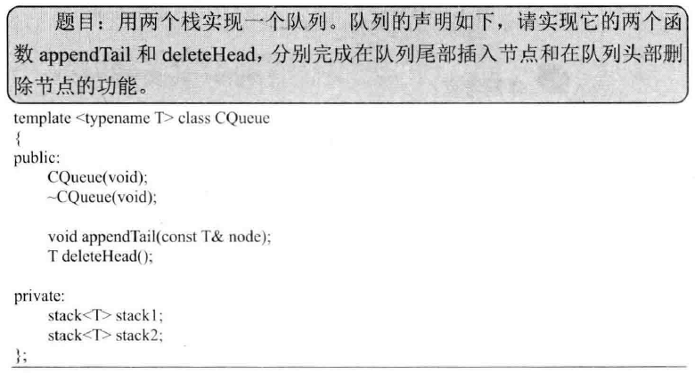
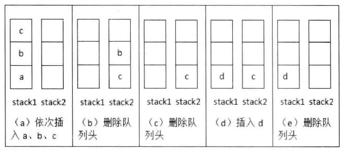

## 两个栈实现队列

> 



```c++
#include <iostream>
#include <stack>
#include <exception>

using namespace std;

template <typename T> class CQueue {
	public:
		CQueue(void);
		~CQueue(void);

		void appendTail(const T& node);
		T deleteHead();
	private:
		stack<T> stack1;
		stack<T> stack2;
};

template <typename T> CQueue<T>::CQueue(void) {

}

template <typename T> CQueue<T>::~CQueue(void) {

}

template <typename T> void CQueue<T>::appendTail(const T& node) {
	stack1.push(node);
}

template <typename T> T CQueue<T>::deleteHead() {
	if(stack2.size() <= 0) {
		while(stack1.size() > 0) {
			T& data = stack1.top();
			stack1.pop();
			stack2.push(data);
		}
	}

	if(stack2.size() == 0) {
		throw new logic_error("queue is empty");
	}

	T head = stack2.top();
	stack2.pop();

	return head;
}

int main(int argc, char *argv[])
{
	CQueue<char> queue;
	queue.appendTail('a');
	queue.appendTail('b');
	queue.appendTail('c');

	char head = queue.deleteHead();
	cout << "first: " << head << endl;

	head = queue.deleteHead();
	cout << "second: " << head << endl;

	head = queue.deleteHead();
	cout << "third: " << head << endl;
	return 0;
}
```
