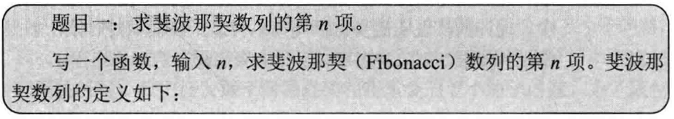
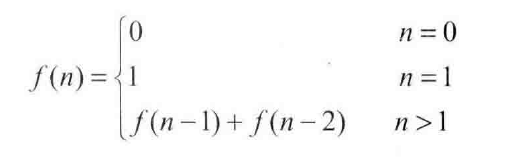

## 斐波那契数列

> 

> 


```c++
#include <iostream>
#include<cassert>

using namespace std;

// 递归
long long fibonacciSolution1(unsigned int n) {
	if(n <= 0) {
		return 0;
	}

	if(n == 1) {
		return 1;
	}

	return fibonacciSolution1(n - 1) + fibonacciSolution1(n - 2);
}

// 循环
long long fibonacciSolution2(unsigned int n) {
	int result[2] = {0, 1};
	if(n < 2) {
		return result[n];
	}

	long long fibNMinusOne = 1;
	long long fibNMinusTwo = 0;
	long long fibN = 0;

	for(unsigned int i = 2; i <= n; i ++) {
		fibN = fibNMinusOne + fibNMinusTwo;

		fibNMinusTwo = fibNMinusOne;
		fibNMinusOne = fibN;
	}

	return fibN;
}

// 矩阵乘法O(log n)
struct Matrix2By2 {
	
	Matrix2By2(){}

	Matrix2By2(
			long long m00,
			long long m01,
			long long m10,
			long long m11)
		: m_00(m00), m_01(m01), m_10(m10), m_11(m11){

		}
	long long m_00;
	long long m_01;
	long long m_10;
	long long m_11;
};

Matrix2By2 matrixMultiply(const Matrix2By2& matrix1, const Matrix2By2& matrix2) {
	return Matrix2By2(
			matrix1.m_00 * matrix2.m_00 + matrix1.m_01 * matrix2.m_10,
			matrix1.m_00 * matrix2.m_01 + matrix1.m_01 * matrix2.m_11,
			matrix1.m_10 * matrix2.m_00 + matrix1.m_11 * matrix2.m_10,
			matrix1.m_10 * matrix2.m_01 + matrix1.m_11 * matrix2.m_11);
}

Matrix2By2 matrixPower(unsigned int n) {
	assert(n > 0);

	Matrix2By2 matrix;

	if(n == 1) {
		matrix = Matrix2By2(1, 1, 1, 0);
	} else if(n % 2 == 0){
		matrix = matrixPower(n / 2);
		matrix = matrixMultiply(matrix, matrix);
	} else if(n % 2 == 1) {
		matrix = matrixPower((n - 1) / 2);
		matrix = matrixMultiply(matrix, matrix);
		matrix = matrixMultiply(matrix, Matrix2By2(1, 1, 1, 0));
	}

	return matrix;
}

long long fibonacciSolution3(unsigned int n) {
	int result[2] = {0, 1};
	if(n < 2) {
		return result[n];
	}

	Matrix2By2 powerNMinus2 = matrixPower(n - 1);

	return powerNMinus2.m_00;
}

int main(int argc, char *argv[])
{
	long long result1 = fibonacciSolution1(9);
	long long result2 = fibonacciSolution2(9);
	long long result3 = fibonacciSolution3(9);

	cout << "solution1 result is: " << result1 << endl;
	cout << "solution2 result is: " << result2 << endl;
	cout << "solution3 result is: " << result3 << endl;

	return 0;
}
```
