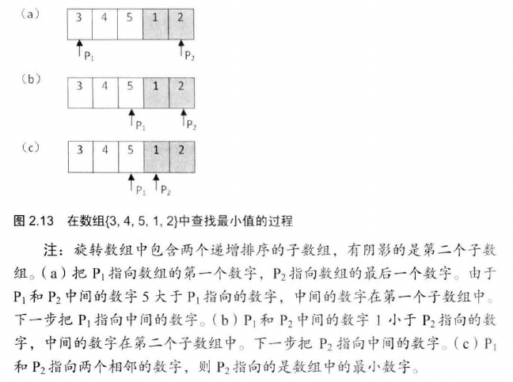

## 旋转数组的最小数字

> 




```c++
#include <iostream>
#include <exception>

using namespace std;

int minInOrder(int* numbers, int index1, int index2) {
	int result = numbers[index1];
	for(int i = index1 + 1; i <= index2; i ++) {
		if(result > numbers[i]) {
			result = numbers[i];
		}
	}
	return result;
}

int min(int* numbers, int length) {
	if(numbers == nullptr || length <= 0) {
		throw new logic_error("Invalid parameters");
	}

	int index1 = 0;
	int index2 = length - 1;
	int indexMid = index1;

	while(numbers[index1] >= numbers[index2]) {
		if(index2 - index1 == 1) {
			indexMid = index2;
			break;
		}

		// 如果下表为index1,index2和indexMid指向的三个数字相等
		// 则只能顺序查找
		if(numbers[index1] == numbers[index2] && numbers[indexMid == numbers[index1]]) {
			return minInOrder(numbers, index1, index2);
		}

		indexMid = (index1 + index2) / 2;
		if(numbers[indexMid] >= numbers[index1]) {
			index1 = indexMid;
		} else if(numbers[indexMid] <= numbers[index2]) {
			index2 = indexMid;
		}
	}
	return numbers[indexMid];
}

int main(int argc, char *argv[])
{
	int numbers[5] = {3, 4, 5, 1, 2};
	int result = min(numbers, 5);
	cout << "result is: " << result << endl;
	return 0;
}
```
