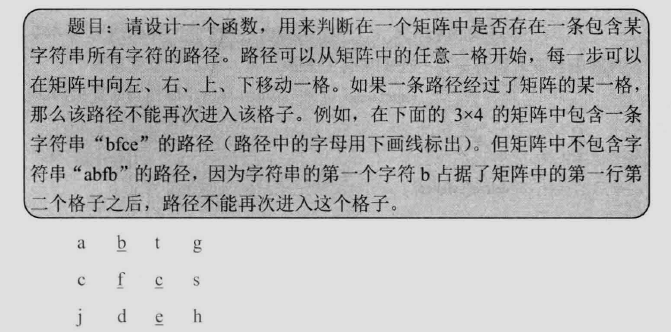

## 矩阵中的路径

> 

```c++
#include <iostream>
#include <string.h>
#include <stack>

using namespace std;

bool hasPathCore(const char* matrix,
		int rows, int cols, int row,
		int col, const char* str,
		int& pathLength, bool* visited) {
	if(str[pathLength] == '\0') {
		return true;
	}
	bool hasPath = false;

	if(row >= 0 && row < rows 
			&& col >= 0 && col < cols
			&& matrix[row * cols + col] == str[pathLength]
			&& !visited[row * cols + col]) {
		pathLength ++;
		visited[row * cols + col] = true;

		hasPath = hasPathCore(matrix, rows, cols, row, col - 1, str, pathLength, visited)
			|| hasPathCore(matrix, rows, cols, row - 1, col, str, pathLength, visited)
			|| hasPathCore(matrix, rows, cols, row, col+1, str, pathLength, visited)
			|| hasPathCore(matrix, rows, cols, row + 1, col, str, pathLength, visited);

		if(!hasPath) {
			pathLength --;
			visited[row*cols] = false;
		}
	}

	return hasPath;
}

bool hasPath(const char* matrix, int rows, int cols, const char* str) {
	if(matrix == nullptr || rows < 1 || cols < 1 || str == nullptr) {
		return false;
	}

	bool* visited = new bool[rows * cols];
	memset(visited, 0, rows * cols);

	int pathLength = 0;

	for(int row = 0; row < rows; row ++) {
		for (int col = 0; col < cols; col ++) {
			if(hasPathCore(matrix, rows, cols, row, col, str, pathLength, visited)) {
				return true;
			}
		}
	}
	
	delete[] visited;

	return false;
}

int main(int argc, char *argv[])
{
	const char* matrix = "abtgcfcsjdeh";
	const char* str1 = "bfce";
	bool result1 = hasPath(matrix, 3, 4, str1);
	cout << "bfce: " << result1 << endl;
	
	const char* str2 = "abfb";
	bool result2 = hasPath(matrix, 3, 4, str2);
	cout << "abfb: " << result2 << endl;
	return 0;
}
```
