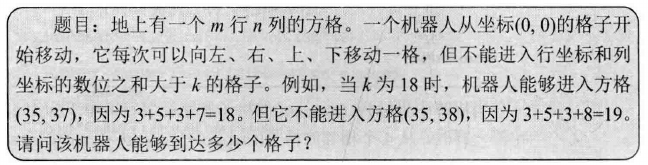

## 机器人的运动范围

> 

回溯法

```c++
#include <iostream>

using namespace std;

int getDigitSum(int number) {
	int sum = 0;
	while(number > 0) {
		sum += number % 10;
		number /= 10;
	}
	return sum;
}

// 判断机器人能否进入坐标为(row, col)的方格
bool check(int threshold, int rows, int cols, int row, int col, bool* visited) {
	if(row >= 0 && row < rows && col >=0 && col < cols
			&& getDigitSum(row) + getDigitSum(col) <= threshold
			&& !visited[row * cols + col]) {
		return true;
	}
	return false;
}

int moveCountCore(int threshold, int rows, int cols, int row, int col, bool* visited) {
	int count = 0;

	if(check(threshold, rows, cols, row, col, visited)) {
		visited[row * cols + col] = true;
		count = 1 + moveCountCore(threshold, rows, cols, row - 1, col, visited)
				+ moveCountCore(threshold, rows, cols, row, col - 1, visited)
				+ moveCountCore(threshold, rows, cols, row + 1, col, visited)
				+ moveCountCore(threshold, rows, cols, row, col + 1, visited);
	}
	return count;
}

int moveCount(int threshold, int rows, int cols) {
	if(threshold < 0 || rows <= 0 || cols <= 0) {
		return 0;
	}
	bool* visited = new bool[rows * cols];
	for(int i = 0; i < rows * cols; i ++) {
		visited[i] = false;
	}

	int count = moveCountCore(threshold, rows, cols, 0, 0, visited);

	delete[] visited;

	return count;
}

int main(int argc, char *argv[])
{
	// 359
	int r = moveCount(15, 20, 20);
	cout << "result:";
	cout << r << endl;
	return 0;
}
```
