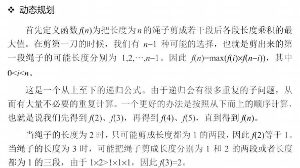

## 剪绳子

> 




```c++
#include <iostream>
#include <math.h>

using namespace std;

// 动态规划
int maxProductAfterCutting_sulotion1(int length) {
	if(length < 2) {
		return 0;
	}
	if(length == 2) {
		return 1;
	}
	if(length == 3) {
		return 2;
	}

	int *products = new int[length + 1];
	products[0] = 0;
	products[1] = 1;
	products[2] = 2;
	products[3] = 3;

	int max = 0;

	for(int i = 4; i <= length; i ++) {
		max = 0;
		for(int j = 0; j <= i / 2; j ++) {
			int product = products[j] * products[i - j];
			if(max < product){
				max = product;
			}
			products[i] = max;
		}
	}
	max = products[length];
	delete[] products;

	return max;
}

int maxProductAfterCutting_sulotion2(int length) {
	if(length < 2) {
		return 0;
	}
	if(length == 2) {
		return 1;
	}
	if(length == 3) {
		return 2;
	}

	// 尽可能多地去剪长度为3的绳子段
	int timesOf3 = length / 3;

	// 当绳子最后剩下的长度为4的时候，不能再剪去长度为3的绳子段
	// 此时更好的方法是吧绳子剪成长度为2的两段，
	if(length - timesOf3 * 3 == 1) {
		timesOf3 -= 1;
	}
	
	int timesOf2 = (length - timesOf3 * 3) / 2;

	return (int) (pow(3, timesOf3)) * (int) (pow(2, timesOf2));
}

int main(int argc, char *argv[])
{
	int length = 8;
	int result1 = maxProductAfterCutting_sulotion1(length);
	int result2 = maxProductAfterCutting_sulotion2(length);

	cout << "result1: " << result1 << endl;
	cout << "result2: " << result2 << endl;
	return 0;
}
```
